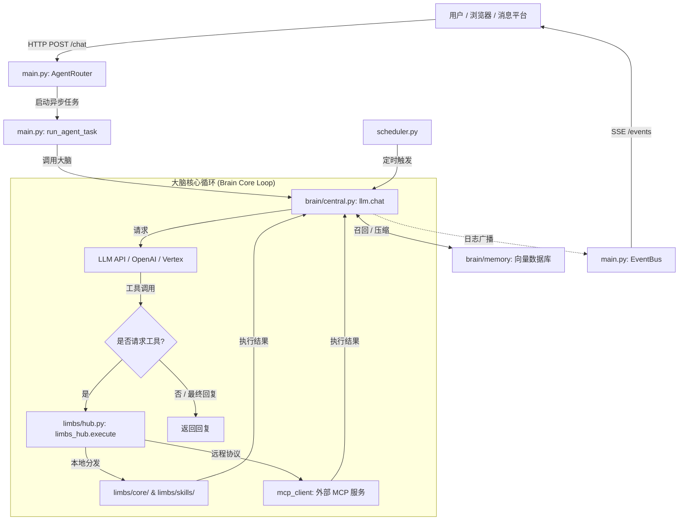

# CyberGrunt (赛博牛马) -- 自进化 AI 智能体系统

> **注**：本项目基于 [wangziqi06/724-office](https://github.com/wangziqi06/724-office) 衍生并深度重构。感谢原作者提供的高质量核心代码参考。

这是一个在生产环境运行的 AI 智能体，使用 **约 3,500 行纯 Python 代码** 构建，**零框架依赖**。
没有 LangChain，没有 LlamaIndex，没有 CrewAI -- 仅使用标准库 + 3 个轻量级包（`croniter`, `lancedb`, `websocket-client`）。

**26 个工具。8 个文件。24/7 全天候运行。**

由个人在 3 个月内利用 AI 协作开发工具构建。已投入生产环境 24/7 运行。

## 特性

- **工具使用循环 (Tool Use Loop)** -- 兼容 OpenAI 的函数调用，具备自动重试机制，单次对话最高支持 20 次迭代。
- **三层记忆系统** -- 会话历史 + LLM 压缩的长期记忆 + LanceDB 向量检索。
- **插件热重载 (Hot-Reloading)** -- 实时监控 `plugins/` 目录，动态加载/更新 Python 工具，无需重启服务。
- **运行时工具创建** -- 智能体可以在运行时编写、保存并加载新的 Python 工具 (`create_tool`)，实现自我能力扩充。
- **MCP/插件系统** -- 通过 JSON-RPC（stdio 或 HTTP）连接外部 MCP 服务器，支持统一调度。
- **自我修复** -- 每日自检、会话健康诊断、错误日志分析、故障自动通知。
- **Cron 调度** -- 支持单次和周期性任务，跨重启持久化，时区感知。
- **多租户路由** -- 基于 Docker 的自动配置，每个用户一个容器，具备健康检查功能。
- **多模态** -- 处理图像/视频/文件/语音/链接，ASR（语音转文本），通过 base64 实现视觉能力。
- **网页搜索** -- 多引擎（Tavily, web search, GitHub, HuggingFace）自动路由。
- **视频处理** -- 裁剪、添加背景音乐、AI 视频生成 -- 全部通过 ffmpeg + API 实现，并封装为工具。
- **即时通讯集成** -- 集成企业微信 (WeChat Work)，支持消息防抖、长消息拆分、媒体文件上传/下载。

## 架构 (Architecture)



## 工作原理

该系统采用典型的 **“入口-大脑-手脚”** 架构，实现高度自治的对话与任务处理：

| 模块 | 角色 | 核心职责 |
| :--- | :--- | :--- |
| **`main.py`** | **入口/感官** | 运行异步 HTTP 服务器，管理 EventBus (SSE) 实时日志，处理消息防抖与分发。 |
| **`brain/central.py`** | **大脑/决策** | 核心逻辑。负责工具调用循环、系统提示词管理、多模态处理及会话上下文控制。 |
| **`limbs/`** | **手脚/执行** | 模块化的工具集。包含核心能力 (`core`)、扩展技能 (`skills`) 及 MCP 远程服务。 |
| **`messaging.py`** | **嘴巴/反馈** | 统一的消息推送接口，支持文本、富文本卡片及媒体文件发送。 |

---

### 一个消息的“生命周期” (以 Telegram 消息为例)

1.  **接收 (Webhook)**: 
    当你给 Bot 发消息时，服务器会通过 HTTP POST 接收到原始数据。
2.  **防抖处理 (Debounce)**:
    系统收到消息后会等待 3 秒（防抖）。这是为了防止你连续发“文字+图片”时，系统把它拆成两个任务，它会将 3 秒内的碎片消息合并处理。
3.  **大脑思考 (LLM Loop)**:
    合并后的消息传给 `brain/central.py`。大脑会进行决策：
    - 用户问了什么？
    - 我有多少个工具（Limbs）可以用？
    - 我需不需要调用工具来获取更多信息（如 `web_search`）？
4.  **循环执行 (Tool Use Loop)**:
    如果大脑决定使用工具，它会通过 `limbs/hub.py` 分发执行。执行结果返回给大脑，大脑再次思考：“现在的搜索结果够回答用户了吗？”。如果不够，它会继续调用工具，单次对话最多循环 **20 次**。
5.  **回复 (Send Message)**:
    当大脑生成最终回复后，结果通过 `EventBus` 推送到前端或通过 `messaging.py` 推送到移动端。

---

## 核心机制详解

*   **自进化 (Self-Evolving)**: 
    这是项目最核心的特性。`tools.py` 包含 `create_tool` 工具。如果用户要求的功能系统尚不具备，大脑可以编写 Python 代码，存成新工具，并**当场加载使用**。
*   **三层记忆 (`memory.py`)**:
    - **短期**: 存放在 `sessions/` 目录下的 JSON，记录最后 40 句对话。
    - **长期**: 超过 40 句后，旧对话会被压缩成“事实碎块”，存入 `LanceDB` 向量数据库。
    - **召回**: 提问时，大脑会自动去向量库里搜索相关的历史碎块并注入 Prompt。
*   **任务调度 (`scheduler.py`)**:
    大脑可以通过 `schedule` 工具给自己定闹钟。任务写进 `jobs.json`，由后台线程定时触发。
*   **Web 控制台 (本地化支持)**:
    考虑到开发环境可能没有公网 IP，内置了 Web 聊天界面（`http://localhost:8080`），支持同步回复和本地直接调试。

## 记忆系统

```
第一层：会话 (短期)
  - 每个会话保留最后 40 条消息（JSON 文件）
  - 溢出时触发压缩

第二层：压缩 (长期)
  - LLM 从逐出的消息中提取结构化事实
  - 通过余弦相似度去重 (阈值: 0.92)
  - 作为向量存储在 LanceDB 中

第三层：检索 (主动召回)
  - 用户消息 -> 嵌入 (Embedding) -> 向量搜索
  - Top-K 相关记忆注入系统提示词
  - 针对硬件/语音通道的零延迟缓存
```

## 工具列表 (26 个内置)

| 类别 | 工具 |
|----------|-------|
| 核心 | `exec`, `message` |
| 文件 | `read_file`, `write_file`, `edit_file`, `list_files` |
| 调度 | `schedule`, `list_schedules`, `remove_schedule` |
| 媒体发送 | `send_image`, `send_file`, `send_video`, `send_link` |
| 视频 | `trim_video`, `add_bgm`, `generate_video` |
| 搜索 | `web_search` (多引擎: Tavily, web, GitHub, HuggingFace) |
| 记忆 | `search_memory`, `recall` (向量语义搜索) |
| 诊断 | `self_check`, `diagnose` |
| 插件 | `create_tool`, `list_custom_tools`, `remove_tool` |
| MCP | `reload_mcp` |

## 快速开始

1. **克隆并配置：**

```bash
git clone https://github.com/your-username/724-office.git
cd 724-office
cp config.example.json config.json
# 编辑 config.json，填入你的 API 密钥
```

2. **安装依赖：**

```bash
pip install croniter lancedb websocket-client
# 可选: pilk (用于企业微信 silk 语音解码)
```

3. **设置工作空间：**

```bash
mkdir -p workspace/memory workspace/files
```

4. **创建人格文件** (可选但推荐)：

```bash
# workspace/SOUL.md  -- 智能体性格和行为准则
# workspace/AGENT.md -- 操作规程和故障排除指南
# workspace/USER.md  -- 用户偏好和背景上下文
```

5. **运行：**

```bash
python3 xiaowang.py
```

智能体会启动一个 HTTP 服务器，默认端口为 8080。将你的消息平台 Webhook 指向 `http://你的服务器IP:8080/`。

## 配置说明

完整配置结构请参考 `config.example.json`。关键部分包括：

- **models** -- LLM 供应商。支持标准 OpenAI API 及 **Azure OpenAI Service**。
    - 对于 Azure，需设置 `type: "azure"`, `deployment_name` 及 `api_version`。
- **messaging** -- 消息平台凭据
- **memory** -- 三层记忆系统设置
- **asr** -- 语音转文本 API 凭据
- **mcp_servers** -- MCP 服务器连接配置

## 设计原则

1. **零框架依赖** -- 每一行代码都清晰可见且可调试。无魔法，无隐藏抽象。
2. **模块化工具** -- 增加能力 = 在 `limbs/core` 或 `skills` 中添加符合 `limb` 装饰器的函数。
3. **边缘侧部署** -- 专为 Jetson Orin Nano (8GB RAM, ARM64 + GPU) 设计。内存预算低于 2GB。
4. **自进化** -- 智能体可以在运行时创建新工具、诊断自身问题并通知所有者。
5. **离线能力** -- 核心功能在没有云端 API 的情况下仍可工作（LLM 本身除外）。支持本地嵌入 (Local embeddings)。

## 开源协议

MIT
